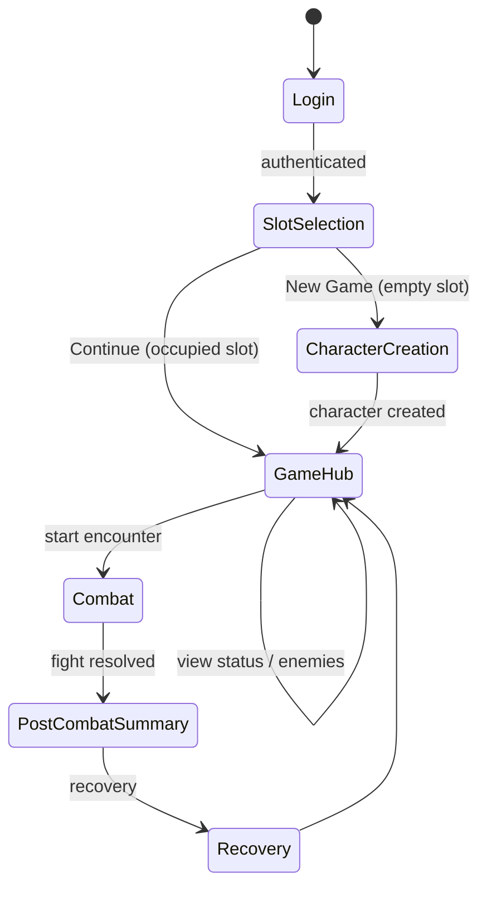
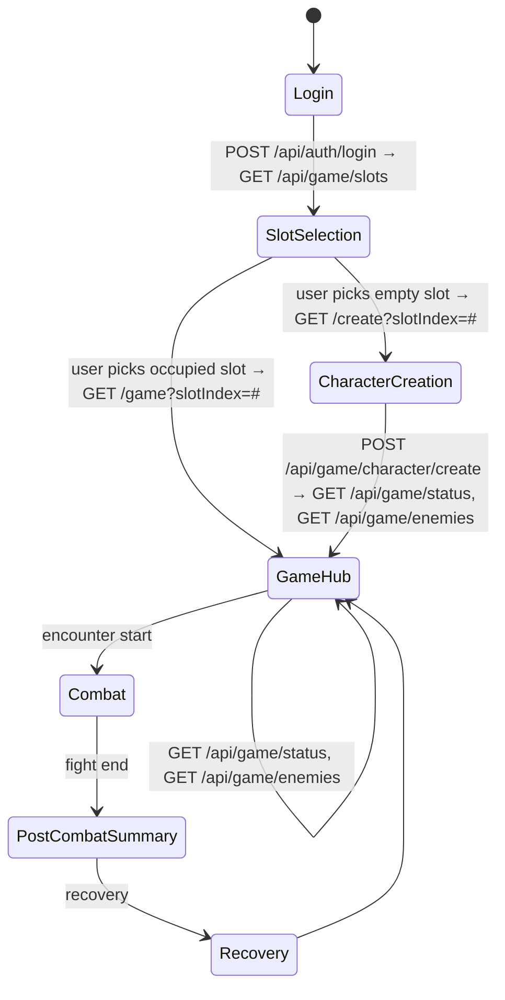

# State Machine

Screen flow: **Login → Slot Selection → Character Creation → Game Hub → (Combat later)**.  
Post-Combat Summary and Recovery

---

## Pure state diagram (Mermaid)

---

## API-driven state diagram (Mermaid)

Shows which API calls drive transitions.

