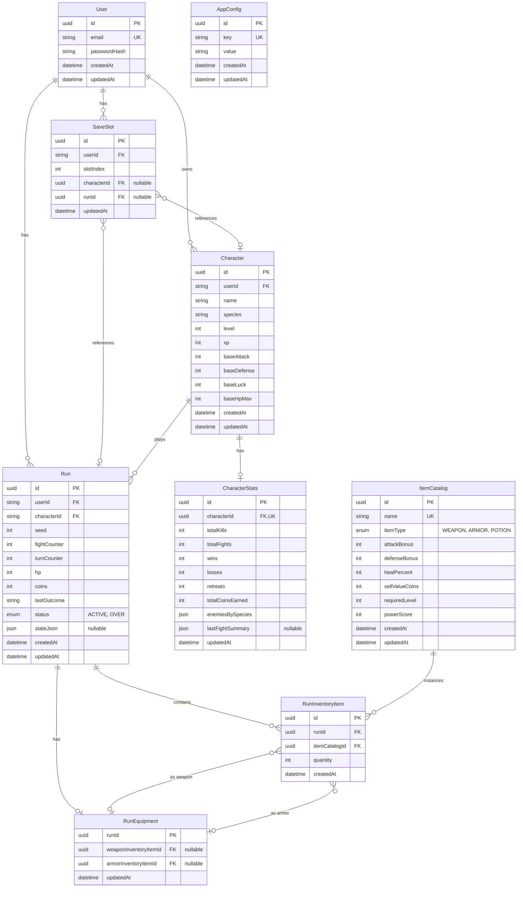

# Database ERD

Entity-relationship diagram for the Fate Engine Postgres schema (Prisma).

## Diagram

## Tables overview

| Table | Purpose |
|-------|---------|
| **User** | Auth; one user has up to 3 save slots (enforced in app). |
| **SaveSlot** | One row per (user, slotIndex). `characterId` and `runId` point to the character and current run in that slot; null when empty. |
| **Character** | Player character; species (HUMAN, DWARF, ELF, MAGE), base stats, level, xp. |
| **Run** | One game run: seed, fight/turn counters, hp, coins, status (ACTIVE/OVER), optional `stateJson` for combat state. |
| **CharacterStats** | Aggregate stats per character (kills, wins, losses, etc.). |
| **ItemCatalog** | Global item definitions (name, type, bonuses, sell value, required level). |
| **RunInventoryItem** | Items in a run’s inventory; references ItemCatalog and Run; quantity for stackables (e.g. potions). |
| **RunEquipment** | One row per run: equipped weapon and armor (nullable RunInventoryItem IDs). |
| **AppConfig** | Key-value config (e.g. feature flags). |

## Key relationships

- **User → SaveSlot:** 1:n; `SaveSlot.userId` + unique `(userId, slotIndex)`.
- **SaveSlot → Character, Run:** Optional FKs; slot is “empty” when both are null.
- **Character → Run:** 1:n; one character can have many runs over time; a run belongs to one character.
- **Run → RunInventoryItem, RunEquipment:** Run owns inventory and one equipment row (weapon/armor).
- **RunInventoryItem → ItemCatalog:** Each inventory row is an “instance” of a catalog item.
- **RunEquipment → RunInventoryItem:** Weapon and armor slots reference inventory items (nullable).
